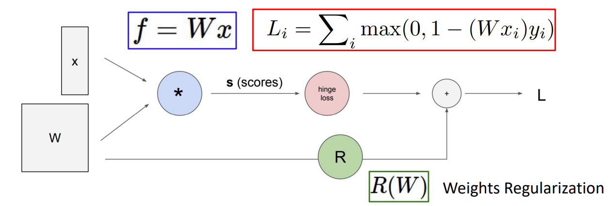
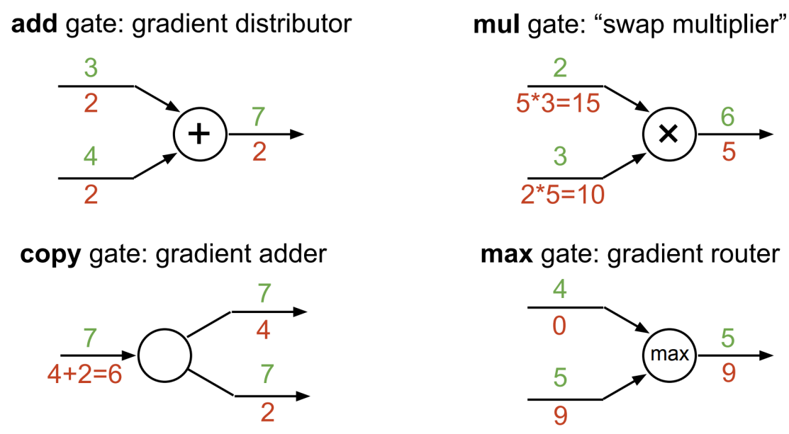

# 3211 midterm revision materials
### Cross validation
1. Split the training data into d groups, or folds, of approximately equal size.
2. Hold the first group. This is called the validation set.
3. Train your classifier on the remaining data.
4. For each value of K
Classify each data in the validation set, using its K-nearest neighbors in the training set.
Record the error.
5. Repeat steps 1-4 for all d choices of the validation set.
6. For each choice of K, find the average error across validation sets. Choose the value of K
with the lowest error
```python
class DFoldCV:
  def __init__(self, X, y, k_list, p_list, d, eval_metric):
    self.X = X
    self.y = y
    self.k_list = k_list
    self.p_list = p_list
    self.d = d
    self.eval_metric = eval_metric

  def generate_folds(self):
    datawl=np.concatenate((self.X,self.y[:,np.newaxis]),axis=1)
    data=self.X.shape
    spliting_point=[(splits * data[0])//self.d for splits in range(self.d+1)]
    train_d_folds=[np.concatenate([datawl[:spliting_point[i]], datawl[spliting_point[i+1]:]],axis=0)
                    for i in range(self.d)]
    test_d_folds=[datawl[spliting_point[i]:spliting_point[i+1]] for i in range(self.d)]
    return train_d_folds, test_d_folds
  
  def cross_validate(self):
    scores=np.zeros((len(self.k_list),len(self.p_list),self.d))
    train_d_folds, test_d_folds=self.generate_folds()
    for ki, k in enumerate(self.k_list):
      for pi, p in enumerate(self.p_list):
        knn_model=KNNModel(k,p)
        for d, (traindata, testdata) in enumerate(zip(train_d_folds,test_d_folds)):
            knn_model.fit(traindata[:,:-1],traindata[:,-1])
            predictions=knn_model.predict(testdata[:,:-1])
            scores[ki,pi,d]=self.eval_metric(predictions,testdata[:,-1])
    return scores
  
  def validate_best_parameters(self):
    # TODO
    scores=self.cross_validate()
    avg_scores = np.average(scores, axis=2)
    ki, pi = np.unravel_index(np.argmax(avg_scores, axis=None), avg_scores.shape)
    k_best, p_best = self.k_list[ki], self.p_list[pi]
    return k_best, p_best # type: tuple
```
Advantages
1. Easy to understand
2. No assumptions
3. Used for both classification and regression
4. Works easily in multiclass

Disadvantages
1. computationally expensive
2. sensitive to scale of data
3. Struggle with high number of attributes
4 does not works well with categorical data

## K-means Clustering
Procedure:
1. Choose K (random) data points (seeds) to be the initial centroids (cluster centers)
2. Find the distances between each data point in our training set with the K centroids
3. Assign each data point to the closest centroid according to the distance found
4. Re-compute the centroids using the current cluster memberships
5. If a convergence criterion is NOT met, repeat steps 2 to 4
```python
Initialize μ = [μ1 .. μk] randomly
For t = 1 .. T:
    # set assignment z given μ
    For each point i = 1 .. n:
        zi = arg min {k=1..K}|ϕ(xi)-μk|^2
    # set centroids μ given z (calculate new centroid)
    For each cluster k = 1 .. K:
        μk = 1/|i:zi = k|  * ∑{i:zi = k}ϕ(xi)
```
### Stopping criterion
1. No/Minimum re-assignments of data points to di↵erent clusters 
2. No/Minimum change of centroids 
3. Minimum decrease in the sum of squared error (SSE) between successive iteration
```python
def fit_predict(self, X, is_categ):
        prev_prototypes = None
        iteration = 0
        while np.not_equal(self.prototypes, prev_prototypes).any() and iteration < self.max_iter:
            numer_dist = self.euclidean_distance(X, is_categ)
            categ_dist = self.hamming_distance(X, is_categ)
            dist = numer_dist + categ_dist
            prototype_idx = dist.argmin(axis=0)
            prev_prototypes = self.prototypes.copy()  # Push current prototypes to previous.
            for i in range(self.k):
                assigned_idx = (prototype_idx.T == i)
                if np.count_nonzero(assigned_idx) == 0:
                    continue
                if np.count_nonzero(~is_categ) > 0:
                    self.prototypes[i, ~is_categ] = np.mean(X[assigned_idx][:, ~is_categ], axis=0)

                if np.count_nonzero(is_categ) > 0:
                    categ_mode, _ = stats.mode(X[assigned_idx][:, is_categ], axis=0, keepdims=True)
                    self.prototypes[i, is_categ] = np.squeeze(categ_mode, axis=0)
            iteration += 1
        return prototype_idx
```
K choosing method:
1. Elbow method
2. Silhouette

> Remember to standardize the data before doing k-means clustering

Quality of Clustering
- maximize inter-cluster distance
- minimize intra-cluster distance
$$Loss_{kmeans}(z,\mu)=\sum_{i=1}^n|\phi(x_i)-\mu_{z_i}|^2$$
### Quality SSE
```python
def SSE(X, y, k, centroids):
    sse = 0
    for i in range(k):
        sse += np.sum((X[y.T == i] - centroids[i]) ** 2)
    return sse
```
### Weakness of K-means
- sensitive to outliers
> 1. remove outliers data points
> 2. perform random sampling (choose small subset of data points)
- sensitive to initial seeds
> run multiple times with different initialization using heuristic strategy and choose the solution with the lowest loss
- cannot discover hyper-ellipsoids

Advantages
1. Easy to understand and implement
2. Iefficient given K and number of iterations is small
Disadvantasges
1. define mean, k-mode is used for categorical data
2. specify k is needed
1. sensitive to outliers
>PCA is applied before k-means clustering

## Linear regression and Classification
### Linear Regression
- weight vector dot product with feature extractor

feature extrator of linear regression default=$[1,x]$
- x: Input; y: Output
$$f_x(w)=w \cdot φ(x)$$
$$F(\text{hypothesis class})=\{f_w:w\in\R^d\}$$
- loss function determines how good is a predictor
>Squared loss
$$Loss(x, y, w)=(f_w(x)-y)^2$$
$$TrainLoss(w)=\frac{1}{|D_{train}|}\sum_{(x,y)\in D_{train}}Loss(x, y, w)$$
### Optimization Algorithms
After partial differentiation of the loss function:
$$\nabla_wTrainLoss(w)=\frac{1}{|D_{train}|}\sum_{(x,y)\in D_{train}}2(w\cdot \phi-y)\phi(x)$$
learning rate eta η
```pseudocode
Gradient Descent Algorithm
Initial w = [0,..,0]
For t=1,..,T:   //epochs
    w = w - η ∇w TrainLoss(w)

Stochastic gradient descent
Initial w = [0,..,0]
For t=1,..,T:   //epochs
    For (x, y) ∈ D_train
        w = w - η ∇w TrainLoss(x, y, w)

Problem: gradient could be very noisy -> unstable learning
Solution: Batch training (Less noisy gradient)

To Generalize the learning algorithm:
- Early stopping (make T smaller) 
- add regularization term to reduce complexities
min_w TrainLoss(w) + λ/2 * w^2

Gradient Descent Algorithm with regularization term
Initial w = [0,..,0]
For t=1,..,T:   //epochs
    w = w - η (∇w TrainLoss(w) + λw)
```
### Non-linear Regression
#### Quadratic predictors
- non-linear

$\phi(x)=[1, x, x^2]$

$\phi(x)=[x_1, x_2, x_1^2+x_2^2]$
#### Piecewise constant predictors
- non-linear

$\phi(x)=[1[0\lt x\leq 1], 1[1\lt x\leq 2], .. ,1[n-1\lt x\leq n]]$
#### Periodicity structured predictors
- linear + non-linear

$\phi(x)=[1,x,x^2,cos(3x)]$
#### Linearity
- Linear in w 
- linear in $\phi(x)$
- Score can be non-linear in x! (Expressiveness)
- Score is always a linear function of w (Efficiency)
### Non-Linear Neural Network
$f_w(x)=w\cdot \sigma(V\cdot \phi(x))$

Interpret h(x) as the learned features (Intermediate features)
$F=\{f_{V,w}:V\in \R^{k\times d}, w\in \R^k\}$
```python
import numpy as np
from numpy.random import randn

N, D_in, H, D_out = 64, 100, 100, 10
x, y = randn(N, D_in), randn(N, D_out) # random vectors 
w1, w2 = randn(D_in, H), randn(H, D_out)
# forward propagation
for t in range(2000):
    h = 1/(1+np.exp(-x.dot(w1))) # input dot weight -> learned feature
    y_pred = h.dot(w2) # predictor is ready
    loss = np.square(y_pred-y).sum() #Squared loss
    print(t, loss)
    # back propagation
    grad_y_pred = 2.0 * (y_pred-y) #Squared loss gradient
    grad_w2 = h.T.dot(grad_y_pred)
    grad_h = gred_y_pred.dot(w2.T)
    grad_w1 = x.T.dot(grad_h * h * (1-h))# gradient h times gradient sigmoid

    w1 -= 1e-4 * grad_w1
    w2 -= 1e-4 * grad_w2
```
### Computational Graph + Backpropagation
- good idea to plot graph instead of tedious calcuations and reformulations


### How to train neural network
- Careful initialization (random noise, pre-training)
- Overparameterization (more hidden units than needed)
- Adaptive step sizes (AdaGrad, Adam)

--> prevent gradient vanishing and explosion
### Classification
Sign function
- sign(z) $(z>0)?+1:(z<0)?-1:0$

Decision booundary: 
- $x$ such that $w\cdot \phi(x)=0$
General binary classifier:
$$f_w(x)=sign(w\cdot \phi(x))$$
> zero-one loss
$$Loss_{0-1}(x,y,w)=1[f_w(x)\neq y]$$
How **Confident** we are in predicting +1

$Score: w\cdot \phi(x)$

How **Correct** we are

$Margin:Score\times y= (w\cdot \phi(x))y=1[(w\cdot \phi (x))y\leq 0]$

$\nabla_wLoss_{0-1}(x, y, w) = \nabla 1[(w\cdot \phi (x))y\leq 0]$
>hinge loss

$Loss_{hinge}(x, y, w)=\{1-(w\cdot \phi(x))y,\space 0\}$

$$\nabla_wLoss_{0-1}(x, y, w) = \begin{cases}-\phi(x)y &\text{if}\space\space 1-(w\cdot \phi(x))y>0\\
0 & otherwise\\
\end{cases}$$

>logistic regression
- intuition: increase margin when it already exceed 1

$Loss_{logistic}(x, y, w)=log(1+e^{-(w\cdot \phi (x))y})$

``` Model Development Strategy
Split data into train, validation, test
Look at data to get intuition
Repeat:
    Implement model/feature, adjust hyperparameters
    Run learning algorithm
    Check train and validation error rates
    Look at weights and prediction errors
Evaluate on test set to get final error rates
```
## Search
- Need to consider sequences of actions and expect to select the best sequence for the goal
#### State space 
- entire problem domain
#### successor function 
Input: Current state, action

Output: Successor state, cost
#### Start State
- initial node (starting point)
#### Goal State
- Determines whether a state is a goal state
### General Tree Search
```psuedocode
function TREE-SEARCH(problem, strategy) returns a solution/ failure
    initialize the search tree using the initial state of problem
    loop do
        if there are no candidates for expansion then 
            return failure 

        choose a leaf node for expansion according to strategy
        if the node contains a goal state then 
            return the corresponding solution
        else expand the node and add the resulting node into the search tree
```
Frontier: partial plans under consideration

Expansion: remove a node in frontier and replace frontier with its reuslting childrens

Exploration strategy: Which node to be picked up first in the frontier

Expanded Nodes + Frontier Nodes + Unexplored

### Uninformed Search
- only use problem definition information

Complete: Guaranteed to find a solution if exist
Optimal: Guaranteed to find the least cost path
#### DFS
Expand the deepest node first

b: branching factor; m: depth of nodes

- Complete: NO! (cyclic state graph)
- Optimal: Not Optimal Since only leftmost solution is explored
- Time Complexity: $O(b^m)$
- Space Complexity $O(bm)$
- More memory efficient than BFS in dense distribution of solution
#### BFS
Expand a shallowest node first

s: Shalloweest solution Depth

- Complete: Yes because s must be finite
- Optimal: Yes if costs are equal
- Time Complexity: $O(b^s)$
- Space Copmlexity: $O(b^s)$
- More time efficient if solution have a shallow distribution in the tree
#### iterative Deepening Search
Get DFS space advantages with BFS time advantages

k: Shalloweest solution Depth

- Complete: Yes when b is finite
- Optimal: Yes when the path cost is a non-decreasing function of depth
- Time Complexity: $O(b^k)$
- Space Complexity $O(bk)$
- preferred when the depth of solution is not known and the search space is large
#### UCS
Expand lowest g(n): cost from root to n

C*: solution costs
ε : minimal cost between 2 nodes
C*/ε : effective depth

- Complete: Yes Assuming C* is finite, ε > 0
- Optimal: Yes
- Time Complexity: $O(b^{C*/ε})$
- Space Complexity: $O(b^{C*/ε})$