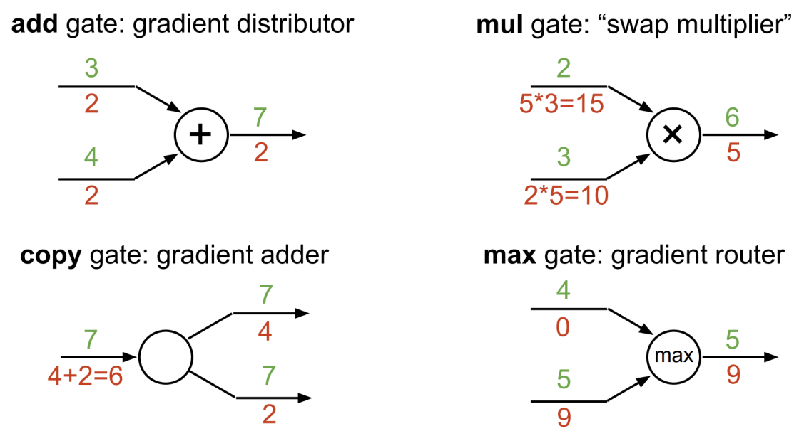

## Background of AI
AI is the science and engineering of making intelligent machines.
### Important contributions
- Founder of AI -- *Alan Turing*
- first person to coin the term "Artificial intelligence" -- *John McCarthy*
- first person to study neural networks and deep learning (perceptrons) -- *Frank Rosenblatt*
- coined the term “machine learning” -- *Arthur Samuel*
- first expert system in artificial intelligence -- *Edward Albert Feigenbaum*
- *IBM Deep Blue* Beat the world chess champion
- Roomba, an autonomous vacuum cleaner that avoids obstacles
- *IBM’s Watson supercomputer* defeated humans in the final Jeopardy match
- comes up with Generative Adversarial Network (GAN) --*Ian Goodfellow*
- AlphaGo beats professional Go player
### the foundations of AI (for now)
Mathematics/ Neurobiology/ Cognition Science/ Philosophy/ Computer Science/ Linguistics
### Applications of AI
- Gaming and entertainment
- speech recognition
- NLP
- computer vision
- expert system
- healthcare
- air transport
- banking/ finance
- logistics
- ecommerce
- hiring

AI-->ML-->DL

ML -- provides the learning ability and improve from experience to help solving problems from structured data set (discover relationships)

DL -- highly complex neural networks that mimic the way human brain works in unstructured data set

> Structured data is data that adheres to a pre-defined data model and is therefore straightforward to analyse. Structured data conforms to a tabular format with relationship between the different rows and columns. Common examples of structured data are Excel files or SQL databases.

### Advantages of AI
- Reduction in human error
- Takes risks instead of humans
- Available 7x24
- Helps in repetitive work
- Digital assistance
- Faster decisions
- New inventions

### Disadvantages of AI
- High costs of creation
- Making humans lazt
- umemployment
- emotionless
- lack of box thinking
#### Turing Test
empirically determine whether a computer has achieved intelligence.
- success if the questioner cannot differentiate which responds are from AI or human

### python for AI
Advantages
1. Easy to learn and read
2. A vast number of machine learning libraries and useful tools
3. Popularity and large community
4. Many useful machine-learning repositories
5. Easy to integrate with other programming languages

Disadvantages
1. Speed limitations
2. Not suitable for mobile and game development
3. Design limitation


# Supervised learning
## Naive Bayes Classifier
- labeled dataset
1. Classification: Classify the data into categories (also called classes – represented using
different labels).
2. Regression: Give a real or continuous value as output.
For example, salary based on work experience, weight based on height, etc
#### Applications
- Image classification
- Visual recognition
- Signature recognition
- Spam detection
- Weather forecasting
### Unsupervised learning
1. Clustering: Group data into clusters that are similar between them and are dissimilar to the
objects belonging to another cluster. For example, finding out which customers made similar
product purchases.
2. Association: A rule-based machine learning to discover the probability of the co-occurrence
of items in a collection. For example, finding out which products were purchased together.
#### Applications
- Semantic Clustering
- Identifying Accident Prone Areas

| supervised  | unsupervised  |
|---|---|
| classification/ regression  | clustering/ association  |
| Calculate outcomes  | discover patterns  |
| Short training time  | long training time  |
| High accuracy  | low accuracy  |
| depend on the data and learning algo  | depend on the data  |
| Na¨ıve Bayes, K-Nearest Neighbour, Decision Tree, Linear Regression, Logistics Regression, Support Vector Machine  | K-Means Clustering, Hierarchical Clustering, Apriori Algorithm  |

$$P(B|E)=\frac{P(E|B)\times P(B)}{P(E)}$$
Posterior: P(B|E) Prior: P(B) Likelihood: P(E|B) Marginal: P(E)
```python 
def estimate_class_prior(self):
    deltas = (np.arange(self.num_classes) == self.train_labels.reshape(-1, 1))
    class_count = np.sum(deltas, axis=0)
    class_prior = (class_count + 1) / (np.sum(class_count) + self.num_classes)
    return class_prior

  def estimate_likelihoods(self):
    deltas = (np.arange(self.num_classes) == self.train_labels.reshape(-1, 1))
    feature_count = np.dot(self.train_dataset.transpose(), deltas.astype(int))
    likelihoods = (feature_count + 1) / (np.sum(deltas, axis = 0) + 2)
    return likelihoods

  def predict(self, test_dataset):
    class_prior = self.estimate_class_prior()
    yes_likelihoods = self.estimate_likelihoods()
    no_likelihoods = 1 - yes_likelihoods
    log_class_prior = np.log(class_prior)
    log_yes_likelihoods = np.log(yes_likelihoods)
    log_no_likelihoods = np.log(no_likelihoods)
    log_prob = log_class_prior + np.dot(test_dataset, log_yes_likelihoods) + np.dot(test_dataset == False, log_no_likelihoods)
    test_predict = np.argmax(log_prob, axis=1)
    return test_predict
```
#### Multiple belief and evidence

### Assumptions
1. independent
2. equal contribution to the belief
3. Probability of likelihood follows Guassian distribution for continuous variables

remove denominator if we are only interested in knowing which belief has the highest probability value and perform argmax
#### normalization is needed
denote posterior by P:
$$\frac{P_1}{P_1+P_2}$$
### Underflow prevention
may cause floating point underflow:
summing logs of probabilities

### Applications
- Real-time prediction
- Multi-class prediction
- Text classification
- Recommendation system

Advantages
1. very easy to implement
2. computational efficiency
3. works well in large size dataset
4. predict multiple classes
5. NLP

Disadvantages
1. assumption about the features to be independent which is hardly true in real-life
applications
2. small dataset will decrease the precision value
3. biased results for predicting probability
4. Zero Frequency
## KNN Classifier
- lazy learning --generalize the training data before receiving queries
- non parametric algorithm

Procedure:
1. Prepare training data and test data.
2. Select a value K. **usually K=sqrt(n)**
3. Determine which distance function is to be used.
4. Compute the distance of the new data to its n training samples.
5. Sort the distances obtained and take the K-nearest data samples.
6. Assign the test sample to the class based on the majority vote of its K nearest neighbors
### Standardization
$$Xnew = \frac{X-mean}{sd}$$
```python
means = X.mean(axis=0)
stds = X.std(axis=0, ddof=1)
X = (X - means)/stds
```
before calculating distances
- Low K-value is sensitive to outliers and a higher K-value is more resilient to outliers
### Distance functions
- Manhattan Distance
- Cosine Distance

    =$1-cos\theta$ where
$$cos\theta=\frac{\vec a\cdot \vec b}{|\vec a||\vec b|}$$
- Hamming Distance
```python
def hamming_distance(self, X, is_categ, debug_prototypes=None):
        cat_arrayX=X[:,is_categ==1]
        cat_arrayP=prototypes[:,is_categ==1]
        dist = np.sum(np.not_equal(cat_arrayP[:,np.newaxis,:],cat_arrayX[np.newaxis,:,:]),axis=2)
        return dist
```
- Euclidean distance
```python
def euclidean_distance(self, X, is_categ, debug_prototypes=None):
        numerical_arrayX=X[:,is_categ==0]
        numerical_arrayP=prototypes[:,is_categ==0]
        dist = np.power(np.sum(np.power(numerical_arrayP[:,np.newaxis] - numerical_arrayX[np.newaxis,:], 2), axis=2), 1/2)
        return dist
```
- levenshtein distance (optional)
### Break ties
1. Decrease K by 1 until we have broken the tie.
2. Put more weight for the nearest points than the farther points
### Cross validation
1. Split the training data into d groups, or folds, of approximately equal size.
2. Hold the first group. This is called the validation set.
3. Train your classifier on the remaining data.
4. For each value of K
Classify each data in the validation set, using its K-nearest neighbors in the training set.
Record the error.
5. Repeat steps 1-4 for all d choices of the validation set.
6. For each choice of K, find the average error across validation sets. Choose the value of K
with the lowest error
```python
class DFoldCV:
  def __init__(self, X, y, k_list, p_list, d, eval_metric):
    self.X = X
    self.y = y
    self.k_list = k_list
    self.p_list = p_list
    self.d = d
    self.eval_metric = eval_metric

  def generate_folds(self):
    datawl=np.concatenate((self.X,self.y[:,np.newaxis]),axis=1)
    data=self.X.shape
    spliting_point=[(splits * data[0])//self.d for splits in range(self.d+1)]
    train_d_folds=[np.concatenate([datawl[:spliting_point[i]], datawl[spliting_point[i+1]:]],axis=0)
                    for i in range(self.d)]
    test_d_folds=[datawl[spliting_point[i]:spliting_point[i+1]] for i in range(self.d)]
    return train_d_folds, test_d_folds
  
  def cross_validate(self):
    scores=np.zeros((len(self.k_list),len(self.p_list),self.d))
    train_d_folds, test_d_folds=self.generate_folds()
    for ki, k in enumerate(self.k_list):
      for pi, p in enumerate(self.p_list):
        knn_model=KNNModel(k,p)
        for d, (traindata, testdata) in enumerate(zip(train_d_folds,test_d_folds)):
            knn_model.fit(traindata[:,:-1],traindata[:,-1])
            predictions=knn_model.predict(testdata[:,:-1])
            scores[ki,pi,d]=self.eval_metric(predictions,testdata[:,-1])
    return scores
  
  def validate_best_parameters(self):
    # TODO
    scores=self.cross_validate()
    avg_scores = np.average(scores, axis=2)
    ki, pi = np.unravel_index(np.argmax(avg_scores, axis=None), avg_scores.shape)
    k_best, p_best = self.k_list[ki], self.p_list[pi]
    return k_best, p_best # type: tuple
```
Advantages
1. Easy to understand
2. No assumptions
3. Used for both classification and regression
4. Works easily in multiclass

Disadvantages
1. computationally expensive
2. sensitive to scale of data
3. Struggle with high number of attributes
4 does not works well with categorical data

Speed up KNN
1. Reduce the dimension of training data 
    - (e.g., using Principle-Component Analysis).
2. Use good data structures to store the data, e.g., KD-tree.
3. Parallelizing the distance computations

Applications
- Handwritten character classification
- Fast content-based image retrieval
- Intrusion detection
- Fault detection for semiconductor manufacturing processes

# Unsupervised Learning
## K-means Clustering
Procedure:
1. Choose K (random) data points (seeds) to be the initial centroids (cluster centers)
2. Find the distances between each data point in our training set with the K centroids
3. Assign each data point to the closest centroid according to the distance found
4. Re-compute the centroids using the current cluster memberships
5. If a convergence criterion is NOT met, repeat steps 2 to 4
```python
Initialize μ = [μ1 .. μk] randomly
For t = 1 .. T:
    # set assignment z given μ
    For each point i = 1 .. n:
        zi = arg min {k=1..K}|ϕ(xi)-μk|^2
    # set centroids μ given z (calculate new centroid)
    For each cluster k = 1 .. K:
        μk = 1/|i:zi = k|  * ∑{i:zi = k}ϕ(xi)
```
### Stopping criterion
1. No/Minimum re-assignments of data points to di↵erent clusters 
2. No/Minimum change of centroids 
3. Minimum decrease in the sum of squared error (SSE) between successive iteration
```python
def fit_predict(self, X, is_categ):
        prev_prototypes = None
        iteration = 0
        while np.not_equal(self.prototypes, prev_prototypes).any() and iteration < self.max_iter:
            numer_dist = self.euclidean_distance(X, is_categ)
            categ_dist = self.hamming_distance(X, is_categ)
            dist = numer_dist + categ_dist
            prototype_idx = dist.argmin(axis=0)
            prev_prototypes = self.prototypes.copy()  # Push current prototypes to previous.
            for i in range(self.k):
                assigned_idx = (prototype_idx.T == i)
                if np.count_nonzero(assigned_idx) == 0:
                    continue
                if np.count_nonzero(~is_categ) > 0:
                    self.prototypes[i, ~is_categ] = np.mean(X[assigned_idx][:, ~is_categ], axis=0)

                if np.count_nonzero(is_categ) > 0:
                    categ_mode, _ = stats.mode(X[assigned_idx][:, is_categ], axis=0, keepdims=True)
                    self.prototypes[i, is_categ] = np.squeeze(categ_mode, axis=0)
            iteration += 1
        return prototype_idx
```
K choosing method:
1. Elbow method
2. Silhouette

> Remember to standardize the data before doing k-means clustering

Quality of Clustering
- maximize inter-cluster distance
- minimize intra-cluster distance
$$Loss_{kmeans}(z,\mu)=\sum_{i=1}^n|\phi(x_i)-\mu_{z_i}|^2$$
### Quality SSE
```python
def SSE(X, y, k, centroids):
    sse = 0
    for i in range(k):
        sse += np.sum((X[y.T == i] - centroids[i]) ** 2)
    return sse
```
### Weakness of K-means
- sensitive to outliers
> 1. remove outliers data points
> 2. perform random sampling (choose small subset of data points)
- sensitive to initial seeds
> run multiple times with different initialization using heuristic strategy and choose the solution with the lowest loss
- cannot discover hyper-ellipsoids

Advantages
1. Easy to understand and implement
2. Iefficient given K and number of iterations is small
Disadvantasges
1. define mean, k-mode is used for categorical data
2. specify k is needed
1. sensitive to outliers
>PCA is applied before k-means clustering

## ANN Perceptrons
(Supervised learning for binary classifier)
Epoch refers to one cycle through the full training dataset
### Stopping criterion
1. maximum training time
2. maximum number of training allowed
3. minimum accuracy

Applications
- images classifier
- spam detection 
- handwritten digit recognition

Limitations:
1. Can only represent a limited set of functions.
2. Can only distinguish (by the value of its output) the sets of inputs that are linearly separable
in the inputs.
```python
class MyPerceptron(object):
    def __init__(self, lr=0.01, epoch=10, in_weight=0.0):
        self.lr = lr  # learning rate
        self.epoch = epoch  # the max epoch of training
        self.in_weight = in_weight  # the initial value of weights_and_bias
    def fit(self, X, Y):
        # Fit the training data
        # X: Training vectors, X.shape = [#samples, #features]
        # Y: Target values, Y.shape = [#samples]
        self.weights_and_bias = np.full(1+X.shape[1], self.in_weight)
        self.errors = []
        i = 0
        while i < self.epoch:
            count_err = 0
            for xi, yi in zip(X, Y):
                delta = yi - self.predict(xi)
                self.weights_and_bias[1:] += delta * self.lr * xi
                self.weights_and_bias[0] += delta * self.lr
                count_err += int(delta != 0)
            self.errors.append(count_err)
            if 0.02 >= count_err / X.shape[0]:
                break
            i += 1
    def predict(self, X):
        response = np.dot(X, self.weights_and_bias[1:])
        response = response + self.weights_and_bias[0]
        prediction = (response > 0).astype(int)
        return prediction
```
## MLP Perceptrons
- feed-forward neural network
- random init of weight and biases
- suitable for regression prediction problems

Procedure:
1. Let the network calculate the output with the given inputs (forward propagation)
2. Calculate the error/loss function (i.e. the di↵erence between the calculated outputs and the
target outputs)
3. Update the weights and biases between the hidden and output layer (backward propagation)
4. Update the weights and biases between the input and hidden layer (backward propagation)
5. Go back to step 1
### Stopping criterion
1. fixed number of iterations
2. Once the training error falls below some threshold.
3. Stop at a minimum of the error on the validation set

### Why Gradient descent is used
- For most non-linear regression problems, there is no closed-form solution.
- Even for those with a closed-form solution, gradient descent is computationally cheaper
(faster) to find the solution.

Sigmoid function is continuous and differentiable --> can be used to find weights and updating rules easily

We need to differentiate the error/loss function if a different loss function is used

Procedures
1. Import the required libraries and define a global variable
2. Load the data
3. Explore the data
4. Build the model
5. Compile the model
6. Train the model
7. Evaluate the model accuracy
8. Save the model
9. Use the model
10. Plotting the confusion matrix

The softmax function is a function that turns a vector of K real values into a vector of K real values that sum to 1
### Problems
1. Vanishing Gradient (Sigmoid/ tanh)
- Slope becomes small/ negative, making training difficult
- Varying parameters of higher layers and parameters of lower layers doesnt change significantly
2. Exploding Gradient
- Slope and model parameters grows exponentially
- avalanche learning progress and model weights may become NaN
3. Overfitting
- models the training data too well, learning detail and noises to the extent which impacts the performance of model on new data
> Add regularization terms
4. Underfitting
- neither model the training data nor generalize to new data
### Number of layers and neuron to use
1. Input layer
- layer = 1; neuron = number of features
2. Output layer
- layer = 1; neuron = 1 unless softmax
3. Hidden layer
- layer = 0 if linearly separable, 1-2 if less complex, 3-5 if large dimensions and feautures
- neuron = between size of input and output, usually $\sqrt{input\space nodes \times output \space nodes}$ and should keep **decreasing** to get closer to pattern extraction
### Roles of Weights and Biases with activation function
- Higher the weight, steeper the activation function
- biases is for shifting the activation function, Ie. + shift left - shift right

Common hidden layers (differentiable non- linear activation function):
- ReLU, Sigmoid, Tanh
> output layer will typically using different activation function from the hidden layers and dependent upon the type of prediction

```layer = tf.keras.layers.Dense(3, kernel_initializer=initializer)```
1. ReLU
- simple to implement
- less susceptible to vanishing gradients
- use He Normal/ He Uniform weight init
- scale input data to *range 0-1*

```initializer = tf.keras.initializers.HeNormal()```

2. Sigmoid/ logistic
- use Glorot Normal/ Glorot Uniform/ Xavier weight init 
- scale input data to *range 0-1*

3. Tanh 
- Glorot Normal/ Gloerot Uniform weight init
- scale input data to *range -1 to 1*

```initializer = tf.keras.initializers.GlorotNormal()```

4. Linear Output
- identity/ no activation
- normalization/ standardization are used
5. Sigmoid output
- 0-1 output
6. Softmax output
- converts array of numbers into array of probabilities
$$f(x_i)=\frac{e^{x_i}}{\sum_{j=0}^{n-1}{e^{x_j}}}$$
- used usually for multi-class classification problems (more than 2 class labels)
### How to choose activation functions
1. hidden layer
- MLP, CNN: ReLU
- RNN: Tanh and Sigmoid
2. Output
- Regression: Linear
- Classification:
- Binary, Multilabel: Sigmoid
- Multiclass: Softmax
> Multiclass assume each sample is assigned to 1 label

> Multilabel assign each sample a set of target label
## Convolutional Neural Network
- Class of ann applied to visual image
### Preprocessing tasks
- Shading correction
- deblurring
- denoising
- contrast enhancement
> DIP enhance quality or extract relevant information


Pixel: I(x,y)

Dimensions: width * height

(0,0) is in top-left corner

Gray scale contains only 8 bit pixel data
#### Read Image
```python
fname: file to read; format: png default
return: numpy array sized (M,N,{nth/3/4}) with 0-1 float for png, int for others
import matplotlib.image as mpimg
mpimg.imread(fname, format=none)
```
#### Show Image
```python
cmap: "gray" else default RBGA
vmin/vmax: smaller than vmin set 0, larger than vmax set 1
Return: AxesImage
import matplotlib.pyplot as plt
plt.imshow(X, cmap, vmin, vmax)
```
#### Save Image
```python
fname: path/ file like object
arr: Image data
Return: AxesImage
plt.imsave(fname, arr)
```
#### Convert Color Image to Grayscale
```python
V = 0.299 * R + 0.587 * G + 0.114 * B
import cv2
grayImg = cv2.cvtColor(img, cv2.COLOR_RGB2GRAY)
```
### Image Affine Transformation
- transformation that preserves collinearity, parallelism, ratio of distances between points
$$M=\begin{bmatrix}
a_{00}&a_{01}&b_{00}\\
a_{10}&a_{11}&b_{10}\\
\end{bmatrix}
\begin{bmatrix}
x\\
y\\
1\\
\end{bmatrix}$$
#### Image Translation
```python
src: input
M: 2*3 transformation matrix
dsize: size of output
cv2.warpAffine(src, M, dsize, flags, borderMode, borderValue)

rows, cols = grayImg.shape
M = np.float32([[1, 0, 100],[0, 1, 50]])
translatedImg = cv2.warpAffine(grayImg, M, (cols,rows))
```
$$M=\begin{bmatrix}
1&0&tx\\
0&1&ty\\
\end{bmatrix}
$$
#### Image Reflection
- along x-axis
$$M=\begin{bmatrix}
1&0&0\\
0&-1&rows-1\\
\end{bmatrix}
$$
- along y-axis
$$M=\begin{bmatrix}
-1&0&cols-1\\
0&1&0\\
\end{bmatrix}
$$
```python
M = np.float32([[1, 0, 0], [0, -1, rows-1]])
```
#### Image Rotation
$$M=\begin{bmatrix}
cos\theta&sin\theta&-x_0cos\theta-y_0sin\theta+x_0\\
-sin\theta&cos\theta&x_0sin\theta-y_0cos\theta+y_0\\
\end{bmatrix}
$$
```python
angle = math.pi/4
M = np.float32([[math.cos(angle), math.sin(angle),
-(cols//2)*math.cos(angle)-(rows//2)*math.sin(angle) + (cols//2)],
[-math.sin(angle), math.cos(angle),
(cols//2)*math.sin(angle)-(rows//2)*math.cos(angle) + (rows//2)]])
```
#### Image Resizing/ Scaling
```python
src: Input image
dsize: output size
interpolation: INTER_NEAREST/INTER_LINEAR/INTER_CUBIC
cv2.resize(src, dsize, dst, fx = 0, fy = 0, interpolation = INTER_LINEAR)
```
## Characteristics of Image Operations
1. point-same coordinate
- Gray scale, Contrast stretching
2. local-neighborhood of that same coordinate
- Image smoothing, image edge detection, image sharpening
3. global-all the values
### Contrast Stretching
$$I_{new}=\frac{I-I_{min}}{I_{max}-I_{min}} \times 255$$
```python
# Convert pixel values from [0,1] to [0,255]
grayImgUint = grayImg*255
grayImgUint = grayImgUint.astype(np.uint8)
# Find min and max pixel values and perform normalization
min = np.min(grayImgUint)
max = np.max(grayImgUint)
imageContrastEnhance = ((grayImgUint-min)/(max-min))*255
```
### Gray Tresholding
- create binary image from grayscle image/ full- color image
$$I_{new}=\begin{matrix}
0\space\space if\space I\space<\space T \\
255\space\space otherwise\\
\end{matrix}$$
```python
processedImg = grayImgUint > 128
```
### Otsu's method
- automatically determine the threshold value T
#### Procedure
1. Select initial T, such as average intensity of image
2. Calculate the mean gray value $\mu_1,\mu_2$ of partition $R_1, R_2$
3. partition image into $R_1,R_2$ using $T$
4. Compute new threshold 
$$T=\frac{1}{2}(\mu_1+\mu_2)$$
5. Repeat 2-4 until unchanging $\mu_1,\mu_2$
```python
source: gray scale img
threshold value: T
maxVal: maximum value to pixel
return: threshhold and cvtimg
cv2.threshold(source, thresholdValue, maxVal, thresholdingTechnique)

thresh, processedImg = cv2.threshold(grayImgUint, 120, 255,
cv2.THRESH_BINARY + cv2.THRESH_OTSU)
```
### Image Convolution
1. Inverse the kernel, left right and up down
2. Slide the kernel to interested point so multiplication
3. Sum and accumulate the output
#### Padding
1. Zero padding
2. Replicate boundary
3. Reflecting boundary
4. Mirroring boundary
```python
cv2.filter2D(src, ddepth, kernel, dst, anchor, delta, borderType=cv2.BORDER_DEFAULT)
# Prepare a kernel (a sharpening kernel here)
kernel_3x3 = np.array([ [0,-1,0],
                        [-1,5,-1],
                        [0,-1,0] ])
for i in range(5): # Perform filtering 5 times
    grayImg = cv2.filter2D(grayImg, -1, kernel_3x3)
```
#### Sharpening kernel

$$M=\begin{bmatrix}
0&0&0\\
0&1&0\\
0&0&0\\
\end{bmatrix}+
\begin{bmatrix}
-1&-1&-1\\
-1&8&-1\\
-1&-1&-1\\
\end{bmatrix}=
\begin{bmatrix}
-1&-1&-1\\
-1&9&-1\\
-1&-1&-1\\
\end{bmatrix}
$$
#### Prewitt Edge kernel
$$M=ver
\begin{bmatrix}
-1&0&1\\
-1&0&1\\
-1&0&1\\
\end{bmatrix}
hor

\begin{bmatrix}
-1&-1&-1\\
0&0&0\\
1&1&1\\
\end{bmatrix}
$$

#### Sobel Edge kernel
$$M=ver
\begin{bmatrix}
-1&0&1\\
-2&0&2\\
-1&0&1\\
\end{bmatrix}
hor

\begin{bmatrix}
-1&-2&-1\\
0&0&0\\
1&2&1\\
\end{bmatrix}
$$
>$Edge\space magnitude = \sqrt{(horizontal\space edge\space value^2 + vertical\space edge\space value^2)}$
## Convolutional Neural Network
- recognize/ clasify images
- neural network with convolution operation in at least one of the layers
### Kernels
- weight connecting feature of input image and the node of hidden layer
- same depth as the input (I.e RGB/ Grayscale)
### Layers
- three main types of layers to build CNN
### Convolutional layer
- calculate number of variables: (size of kernels* depth+1)* number of kernels
    ### Strides
    - amount of movement between kernel to input image

    stride=(height, width)
    - larger strides leads to lower output volume, saving memory, and avoids overfitting
    - Size of output image:
    $$\text{Output size} = (\text{Size of image dimension}-\text{Size of kernel dimension})/\text{Stride}+1$$
    ### Zero Padding
    - add border of pixels al with value zero amoung the boundaries of input images
    - aka same padding, valid padding if no padding is added
    ### Non-linearity
    - Convolution is linear operation, non-linear is needed else more layers will have no impact as 1
    - using ReLU because:
        - does not requires expensive computation
        - speed up convergence of stochastic gradient descent algorithms
### Pooling layer
- ensure subsequent layer of CNN can pick up larger scale details than edges and curves by merging pixel regions
- can tolerate local distortion and translation of patterns of interest
- reduce computational load, memory usage, and number of parameters
    ### Max pooling 
    - apply max filter to non-overlapping subregions
    ### Average pooling
    - apply average filter to non-overlapping subregions
### Fully connected layer
- traditional MLP that uses softmax as output layer
- every neuron in previous layer is connected to the next layer
- use high-level feautures for classifying the input
- (Conv+Pooling) act as extractor while fully connected layer act as classifier
### Procedure
1. init kernels and parameters randomly
2. takes training image as input, go through forward propagation and find th eoutput probabilities
3. Calculate the total error
4. Use backpropagation to update all kernel weoghts to minimize output error
5. Repeat 2-4
### Dropout layer
- solve overfitting problem (for large neural network on relatively small datasets)
- regularization method, some output are randommly dropped out
- force layer to probabilistically take on more/ less responsibility
- wider network should be used to prevent thinning the network during training
- should NOT be used in output layer 
- commonly set as 0.5
### One-hot encoding
```python
np.utils.to_categorical(y_train, num_classes=6)
```
- no data depencies
- training data is more usable and expressive
- can be rescale easily
## Minimax Algorithm
- perfect information(know all moves) + zero-sum(gain= loss of other) + Deterministic(not random)
- max=AI, min=human
- minimize other players force us to receive
- numeric value given to terminal states
- assume MIN plays optimally
### Disadv
- huge branching factor

--> Alpha-beta pruning

Prune if a>=b
### Adv of alpha beta pruning
- reduce number of nodes
- stop access move with minimum option
- improve search procedure
### Disadv of alpha beta pruning
- still slow as all terminal states have to be searched
#### Remedy
- set depth limit
- estimate desirability of position by heurist evalution function
## AI Ethics
- set of values, principles and techniques that employ widely accepted standard of right and wrong to guid development and use of AI technologies
### Examples
- Invading privacy
    - proper conscent
    - fair representation of population data
- biased/ unfair decisions
    - skewed/tainted samples, limited feauture/ population
    - use wide variety of appropriately diverse data for training
- unclear instructions/ overlearning
    - effectively monitored AI models
- poor outcomes/ unreliable decisions
- deny people's decision
## Linear regression and Classification
### Linear Regression
- weight vector dot product with feature extractor

feature extrator of linear regression default=$[1,x]$
- x: Input; y: Output
$$f_x(w)=w \cdot φ(x)$$
$$F(\text{hypothesis class})=\{f_w:w\in\R^d\}$$
- loss function determines how good is a predictor
>Squared loss
$$Loss(x, y, w)=(f_w(x)-y)^2$$
$$TrainLoss(w)=\frac{1}{|D_{train}|}\sum_{(x,y)\in D_{train}}Loss(x, y, w)$$
### Optimization Algorithms
After partial differentiation of the loss function:
$$\nabla_wTrainLoss(w)=\frac{1}{|D_{train}|}\sum_{(x,y)\in D_{train}}2(w\cdot \phi-y)\phi(x)$$
learning rate eta η
```pseudocode
Gradient Descent Algorithm
Initial w = [0,..,0]
For t=1,..,T:   //epochs
    w = w - η ∇w TrainLoss(w)

Stochastic gradient descent
Initial w = [0,..,0]
For t=1,..,T:   //epochs
    For (x, y) ∈ D_train
        w = w - η ∇w TrainLoss(x, y, w)

Problem: gradient could be very noisy -> unstable learning
Solution: Batch training (Less noisy gradient)

To Generalize the learning algorithm:
- Early stopping (make T smaller) 
- add regularization term to reduce complexities
min_w TrainLoss(w) + λ/2 * w^2

Gradient Descent Algorithm with regularization term
Initial w = [0,..,0]
For t=1,..,T:   //epochs
    w = w - η (∇w TrainLoss(w) + λw)
```
### Non-linear Regression
#### Quadratic predictors
- non-linear

$\phi(x)=[1, x, x^2]$

$\phi(x)=[x_1, x_2, x_1^2+x_2^2]$
#### Piecewise constant predictors
- non-linear

$\phi(x)=[1[0\lt x\leq 1], 1[1\lt x\leq 2], .. ,1[n-1\lt x\leq n]]$
#### Periodicity structured predictors
- linear + non-linear

$\phi(x)=[1,x,x^2,cos(3x)]$
#### Linearity
- Linear in w 
- linear in $\phi(x)$
- Score can be non-linear in x! (Expressiveness)
- Score is always a linear function of w (Efficiency)
### Non-Linear Neural Network
$f_w(x)=w\cdot \sigma(V\cdot \phi(x))$

Interpret h(x) as the learned features (Intermediate features)
$F=\{f_{V,w}:V\in \R^{k\times d}, w\in \R^k\}$
```python
import numpy as np
from numpy.random import randn

N, D_in, H, D_out = 64, 100, 100, 10
x, y = randn(N, D_in), randn(N, D_out) # random vectors 
w1, w2 = randn(D_in, H), randn(H, D_out)
# forward propagation
for t in range(2000):
    h = 1/(1+np.exp(-x.dot(w1))) # input dot weight -> learned feature
    y_pred = h.dot(w2) # predictor is ready
    loss = np.square(y_pred-y).sum() #Squared loss
    print(t, loss)
    # back propagation
    grad_y_pred = 2.0 * (y_pred-y) #Squared loss gradient
    grad_w2 = h.T.dot(grad_y_pred)
    grad_h = gred_y_pred.dot(w2.T)
    grad_w1 = x.T.dot(grad_h * h * (1-h))# gradient h times gradient sigmoid

    w1 -= 1e-4 * grad_w1
    w2 -= 1e-4 * grad_w2
```
### Computational Graph + Backpropagation
- good idea to plot graph instead of tedious calcuations and reformulations


### How to train neural network
- Careful initialization (random noise, pre-training)
- Overparameterization (more hidden units than needed)
- Adaptive step sizes (AdaGrad, Adam)

--> prevent gradient vanishing and explosion
### Classification
Sign function
- sign(z) $(z>0)?+1:(z<0)?-1:0$

Decision booundary: 
- $x$ such that $w\cdot \phi(x)=0$
General binary classifier:
$$f_w(x)=sign(w\cdot \phi(x))$$
> zero-one loss
$$Loss_{0-1}(x,y,w)=1[f_w(x)\neq y]$$
How **Confident** we are in predicting +1

$Score: w\cdot \phi(x)$

How **Correct** we are

$Margin:Score\times y= (w\cdot \phi(x))y=1[(w\cdot \phi (x))y\leq 0]$

$\nabla_wLoss_{0-1}(x, y, w) = \nabla 1[(w\cdot \phi (x))y\leq 0]$
>hinge loss

$Loss_{hinge}(x, y, w)=\{1-(w\cdot \phi(x))y,\space 0\}$

$$\nabla_wLoss_{0-1}(x, y, w) = \begin{cases}-\phi(x)y &\text{if}\space\space 1-(w\cdot \phi(x))y>0\\
0 & otherwise\\
\end{cases}$$

>logistic regression
- intuition: increase margin when it already exceed 1

$Loss_{logistic}(x, y, w)=log(1+e^{-(w\cdot \phi (x))y})$

``` Model Development Strategy
Split data into train, validation, test
Look at data to get intuition
Repeat:
    Implement model/feature, adjust hyperparameters
    Run learning algorithm
    Check train and validation error rates
    Look at weights and prediction errors
Evaluate on test set to get final error rates
```
## Search
- Need to consider sequences of actions and expect to select the best sequence for the goal
#### State space 
- entire problem domain
#### successor function 
Input: Current state, action

Output: Successor state, cost
#### Start State
- initial node (starting point)
#### Goal State
- Determines whether a state is a goal state
### General Tree Search
```psuedocode
function TREE-SEARCH(problem, strategy) returns a solution/ failure
    initialize the search tree using the initial state of problem
    loop do
        if there are no candidates for expansion then 
            return failure 

        choose a leaf node for expansion according to strategy
        if the node contains a goal state then 
            return the corresponding solution
        else expand the node and add the resulting node into the search tree
```
Frontier: partial plans under consideration

Expansion: remove a node in frontier and replace frontier with its reuslting childrens

Exploration strategy: Which node to be picked up first in the frontier

Expanded Nodes + Frontier Nodes + Unexplored

### Uninformed Search
- only use problem definition information

Complete: Guaranteed to find a solution if exist
Optimal: Guaranteed to find the least cost path
#### DFS
Expand the deepest node first

b: branching factor; m: depth of nodes

- Complete: NO! (cyclic state graph)
- Optimal: Not Optimal Since only leftmost solution is explored
- Time Complexity: $O(b^m)$
- Space Complexity $O(bm)$
- More memory efficient than BFS in dense distribution of solution
#### BFS
Expand a shallowest node first

s: Shalloweest solution Depth

- Complete: Yes because s must be finite
- Optimal: Yes if costs are equal
- Time Complexity: $O(b^s)$
- Space Copmlexity: $O(b^s)$
- More time efficient if solution have a shallow distribution in the tree
#### iterative Deepening Search
Get DFS space advantages with BFS time advantages

k: Shalloweest solution Depth

- Complete: Yes when b is finite
- Optimal: Yes when the path cost is a non-decreasing function of depth
- Time Complexity: $O(b^k)$
- Space Complexity $O(bk)$
- preferred when the depth of solution is not known and the search space is large
#### UCS
Expand lowest g(n): cost from root to n

C*: solution costs
ε : minimal cost between 2 nodes
C*/ε : effective depth

- Complete: Yes Assuming C* is finite, ε > 0
- Optimal: Yes
- Time Complexity: $O(b^{C*/ε})$
- Space Complexity: $O(b^{C*/ε})$